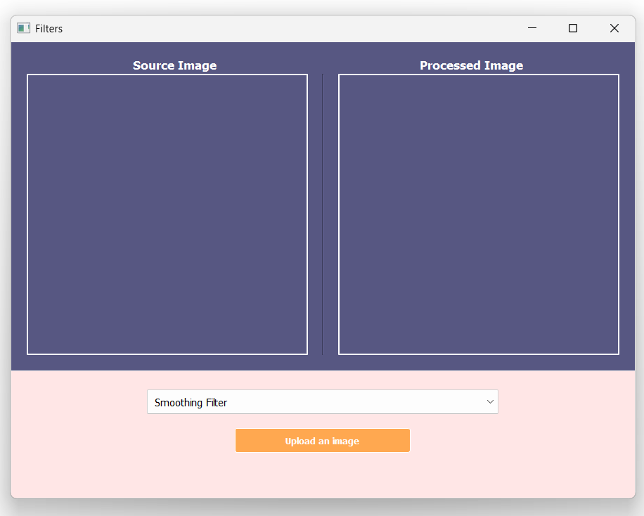
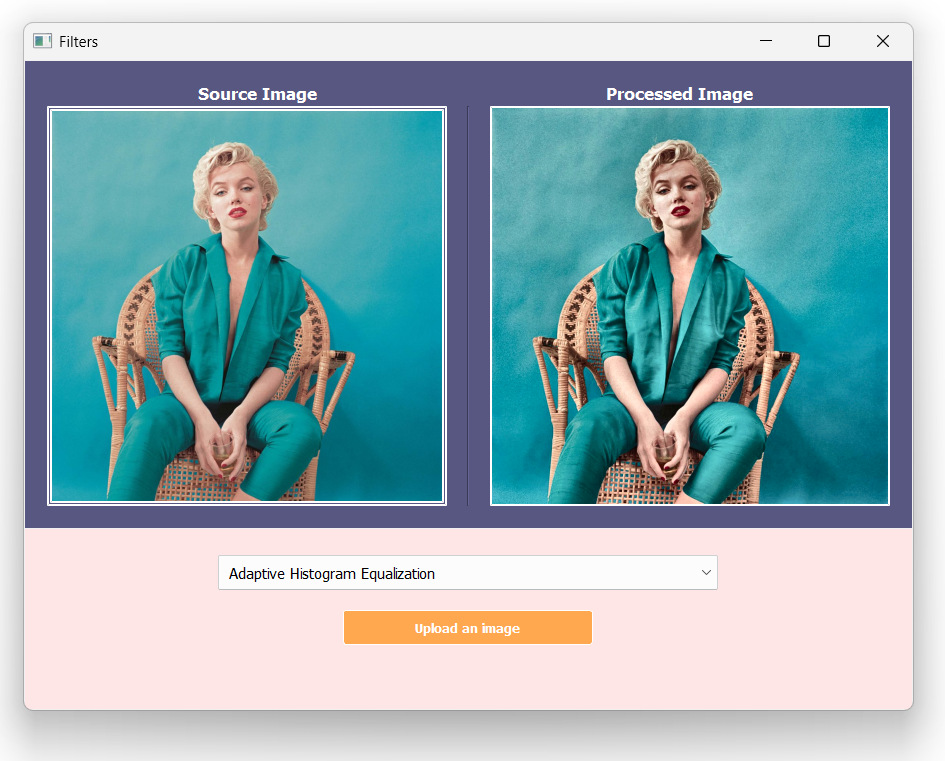

## Filters Project

- GUI for filtering images
- Supported Filters:
    - Smoothing
    - Sharpening
    - Edge Detection (Canny)
    - Histogram Equalization
    - Adaptive Histogram Equalization
    - Thresholding
    - LBP (Local Binary Pattern)

__Note:__ the filters can be extended by adding the preferred filter method to the `Filters` class in `filters.py` and adding the filter to the `filters` list in `apply_filter()` method.

## Requirements

- Python 3.6+
- PyQt5
- OpenCV
- Numpy
- Matplotlib

## Usage

- Run `python main.py` to start the GUI

## Screenshots

